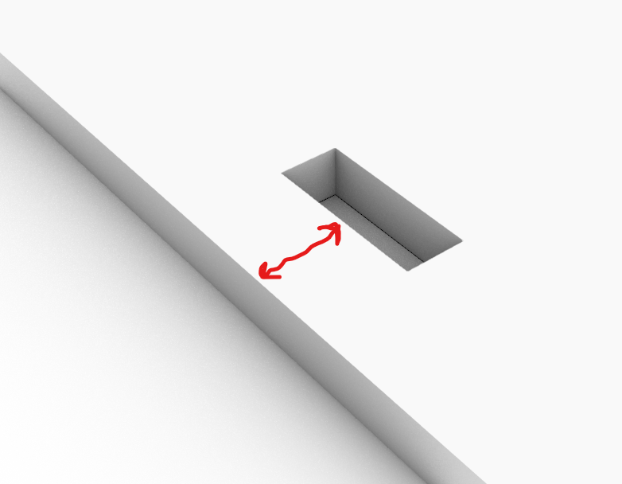

# CNC発注のためのデザインルール

* 使用できる材料

  * 18mm厚シナ合板1220mm x 1220mm、１枚

  * 24mm厚杉材 500mm x 600mm、１枚

* ビット径 1/4inch = 6.35mm

* 最低限残してほしいパーツの太さ
  * シナ合板(18mm厚) 18mm
  * 杉板(24mm厚) 24mm

  

* Make2Dしたら線がバラバラになるので、Joinしておく。

* 座面については、繊維方向がX軸方向に(接着痕が横縞になるように)材がセットされる。

* **ドッグボーン**は6.4mm径でつけておく

* パーツ -材端間距離：20mm

* パーツ -パーツ間距離：20mm

* **オフセット** : 片側0.15mm、両側0.3mm (基本的には穴の方にオフセットかける)

* in-cut、out-cut、materialで**レイヤー分け**　→ **DXFでExport**

* 基本的に半角英数字で名前を付ける("shopbot+学籍番号+氏名.dxf"、例：shopbot12345678pecker.dxf)
  * 合板の場合は、12345678_pecker_plywood.dxf
  * 杉板の場合は、12345678_pecker_cedar.dxf

* 提出フォルダにデータをアップする。

# DXFデータ提出締め切り：2023.06.18 12:00
