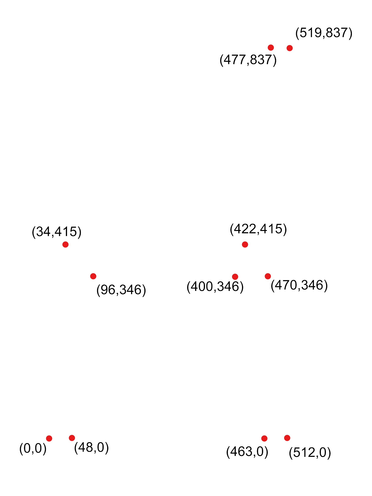

# フラットパックのためのコマンド集

CNCルーターでの家具製作に用いるコマンド集

* #### [Points](http://docs.mcneel.com/rhino/6/help/ja-jp/commands/point.htm)
点を打つ

* #### [Polyline](http://docs.mcneel.com/rhino/6/help/ja-jp/commands/polyline.htm)
ポリラインを描く

* #### [Circle](http://docs.mcneel.com/rhino/6/help/ja-jp/commands/circle.htm)
円を描く

* #### [Rectangle](http://docs.mcneel.com/rhino/6/help/ja-jp/commands/rectangle.htm)
長方形を描く

* #### [Fillet](http://docs.mcneel.com/rhino/5/help/ja-jp/commands/fillet.htm)
カーブの角を丸くする

* #### [ExtrudeCrv](http://docs.mcneel.com/rhino/6/help/ja-jp/commands/extrudecrv.htm)
カーブを押し出して立体にする

* #### [Gumball](http://docs.mcneel.com/rhino/6/help/ja-jp/commands/gumball.htm)
ガムボールを使う

* #### [Move](http://docs.mcneel.com/rhino/6/help/ja-jp/commands/move.htm)
オブジェクトを移動させる

* #### [Rotate](http://docs.mcneel.com/rhino/6/help/ja-jp/commands/rotate.htm)
オブジェクトを回転させる

* #### [Mirror](http://docs.mcneel.com/rhino/6/help/ja-jp/commands/mirror.htm)
オブジェクトを鏡像反転する

* #### [Align](http://docs.mcneel.com/rhino/6/help/ja-jp/commands/align.htm)
複数のオブジェクトを整列させる

* #### [BooleanDifference](http://docs.mcneel.com/rhino/6/help/ja-jp/commands/booleandifference.htm)
オブジェクトの引き算

* #### [FilletEdge](http://docs.mcneel.com/rhino/5/help/ja-jp/commands/filletedge.htm)
3Dオブジェクトの角を丸くする

* #### [Make2D](http://docs.mcneel.com/rhino/6/help/ja-jp/commands/make2d.htm)
3Dオブジェクトを2Dカーブに変換する

* #### [Join](http://docs.mcneel.com/rhino/6/help/ja-jp/commands/join.htm)
線同士を結合させる。端点同士を合わせなきゃいけない。

* #### [Connect](https://docs.mcneel.com/rhino/6/help/ja-jp/commands/connect.htm)
線同士を結合させる。延長&削除を勝手にやってくれる(おススメ！)

* #### [offset](http://docs.mcneel.com/rhino/6/help/ja-jp/commands/offset.htm)
カーブのオフセットを作る

* #### [Trim](http://docs.mcneel.com/rhino/6/help/ja-jp/commands/trim.htm)
カーブを別のカーブでカットする

### サンプル

演習用座標図

