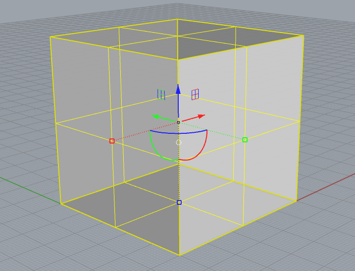

# ガムボール(Gumball)

クリックし、有効にする。

そのあとオブジェクトを選択すると、中心に色々表示されるようになる↓

矢印、円弧、四角それぞれに機能がある。

 
**軸面インジケータ (1)** 
平面アイコンを使ってドラッグすると、その平面に移動を拘束することができる 
**ガムボール原点 (2)** 
ガムボールの原点をドラッグすると、オブジェクト全体をどの方向にも移動することができる 
**メニューボール（3,うさぎの尻尾）** 
クリックすると、ガムボール設定を変更することができる 
**移動矢印 (4、5、6)** 
ガムボールのx、y、またはz矢印コントロールをクリックアンドドラッグすると、オブジェクトを矢印の方向に移動することができる。クリックすると移動距離を入力できる 
**回転円弧 (7、8、9)** 
円弧をクリックアンドドラッグすると、ガムボールの中心を中心にオブジェクトを回転する 
クリックすると、指定の度数を入力できる 
**スケールハンドル (10、11、12)** 
ガムボールのスケールハンドルをクリックアンドドラッグすると、矢印軸に沿って1方向にスケール変更できる 
Shiftキーを押したまま操作すると、3Dスケール変更操作が行える 
原点はガムボールの中心 
**コピー** 
どのコントロールでもドラッグ中にAltキーを押す（タップする）と、コピーを作成することができる 
**値を指定** 
どのコントロールでもダブルクリックすると、距離、角度、スケール値を指定することができる 
